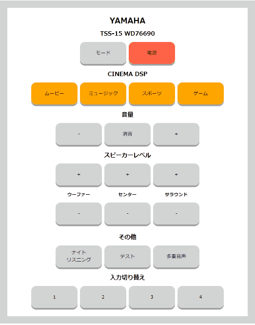

USB赤外線リモコンアドバンス TSS-15 リモコン Webアプリ
====

## 概要

USB赤外線リモコンアドバンスを使用した  
TSS-15(ヤマハのアンプ)のリモコンを模したWebアプリです。  

WebアプリなのでPCやスマホなど、あらゆるプラットフォームで動作します。

このアプリを参考に改造すると、他のアプリを簡単に作ることも可能です。

対応OS : Linux  
Raspberry Pi（ラズベリーパイ）で動きます。

## デモ

## インストール

1. Linuxのコマンドラインツールをインストールします  
https://github.com/nakamichi3011/bto_ir_advanced_cmd

2. Apacheでもlighttpdでも良いので、htmlとphpが動く環境を用意します。

3. このプロジェクトのファイルを適当な場所に置きます

4. jQWidgetsライブラリから必要なものだけ取得します  
https://www.jqwidgets.com/

"./jqwidgets/jqxcore.js"  
"./jqwidgets/jqxbuttons.js"  
使用しているのはRepeatButtonのみです。  
ボリュームボタンを押しっぱなしで動作させる時に使用しています。

## 改造方法

他のリモコンなどを使いたい時の方法です。

本アプリはphpとjQueryとLinuxのシェルスクリプトを使用しています。
jQueryを使ってAJAXでリクエストを送信し、受け取ったphpのコード上で、Linuxのシェルスクリプトを実行しています。

このシェルスクリプトのコードをWindowsのコマンドに変更すれば  
Windowsでも使用できるようになります。

・tss_15_remote.jsについて
これはphp本体で宣言されているボタンのidを使って、
ajaxで、なんのコマンドが実行されたかを送信します。

・tss_15_command.phpについて
これはtss_15_remote.jsから送信された内容を判定して、
send_to_command.sh（シェルスクリプト）を実行します。

・send_to_command.shについて  
これは赤外線リモコンのコマンドラインツールを
ファイル名を引数に渡して呼び出すことでそこからコマンドを呼び出して赤外線送信してくれます。

## ライセンス

[MIT](https://github.com/tcnksm/tool/blob/master/LICENCE)

## 開発元

[nakamichi3011](https://github.com/nakamichi3011)
